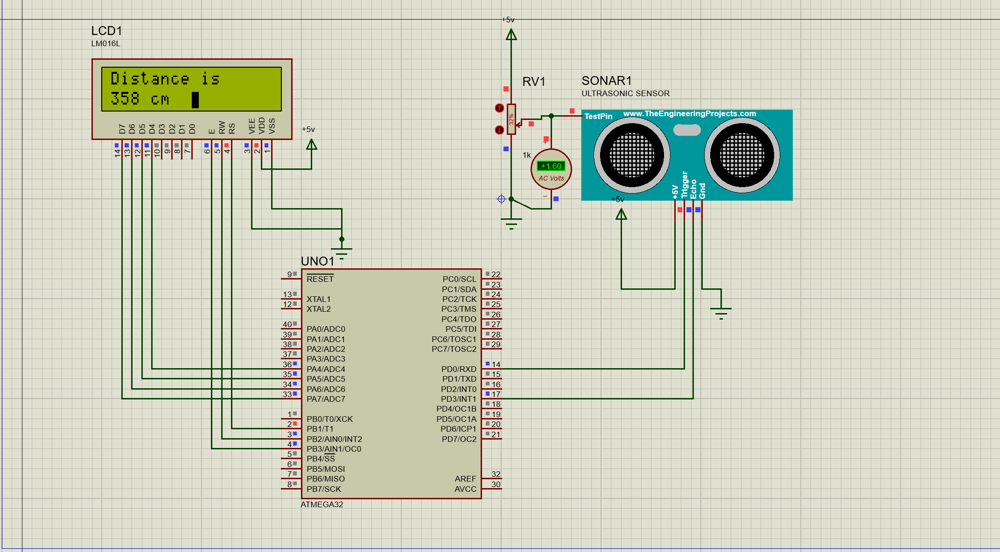

Ultrasonic sensor
================

Introduction
------------
Interfacing an ultrasonic sensor to measure the distance to objects in(cm) and displaying the distance on 2x16 LCD using ATmega32 with the AVR toolchain.

Hardware
--------
* AVR ATmega32 microcontroller.
* Uspasp programmer
* Ultrasonic sensor (HC-SR04)
* 2x16 LCD

Distance Calculation
--------
Sound velocity =   343.00 m/s = 34300 cm/s

Distance of Object (in cm)
                        = (Sound velocity * TIMER Value) / 2

                        = (34300 * TIMER Value) / 2

                        = 17150  * Timer Value

we have selected internal 8 MHz oscillator frequency for ATmega32, with No-presale for timer frequency. Then time to execute 1 instruction is 0.125 us
So, timer gets incremented after 0.125 us time elapse.

                 = 17150 x (TIMER value) x 0.125 x 10^-6 cm

                 = 0.125 x (TIMER value)/58.30 cm

                 = (TIMER value) / 466.47 cm

Circuit
--------

Installation
------------
You will need to have the AVR toolchain installed on your system. This includes:
* avr-gcc
* avr-libc
* avrdude

Support
------
Please feel free to contact me if you have any questions/concerns. My email address is hossamelbahrawy52@gmail.com

